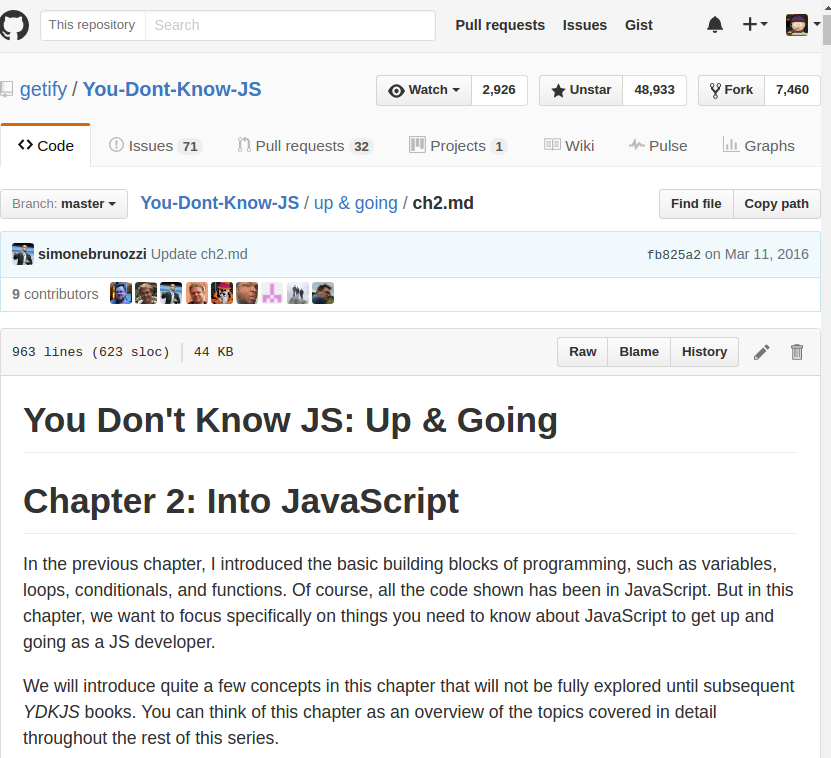

# Responsive Github Extension
Make github.com for Desktop more responsive, so you can split your screen.

## Install
- [From Chrome webstore](https://chrome.google.com/webstore/detail/responsive-github/cjimjpdjjgialboogclbgjoaglpldbof)

#### Example preview

[@juliomatcom](https://twitter.com/juliomatcom)
